# Better Budgets App

This is a solution to the PROG6221 Task 2.

## Table of contents

- [Overview](#overview)
  - [The scenario](#the-scenario)
      - [Updates](#updates)
  - [Built with](#built-with)
  - [Screenshots](#screenshots)
  - [Extra Features](#extra-features)
  - [Changes implemented from feedback](#changes-implemented-from-feedback)

## Overview

## The scenario

The scenario is to create an application that can be used for personal
budget planning. The user needs to input their income and expected monthly expenses. 
When they have entered all the amounts they will be asked if they will be renting a home or buying one.
If the user decides to rent they will be prompted to enter the rent amount per month.
If they decide to buy then they will be prompted to enter the: 
 - Purchase Price
 - Months to Repay Home Loan
 - Interest Rate
 
When user input is complete, the app will calculate the monthly repayment and tell the user whether their home loan will be approved.
Then the app will calculate how much money the user will have available at the end of the month.

Task 2 asks that the user be able to choose whether they are purchasing a vehicle or not. If they decide to purchase a vehicle they will be asked to enter the cars:
 - Model and make
 - Purchase Price
 - Deposit
 - Estimated Monthly Insurance Premium
 - Interest Rate

All vehicles are to be paid off in 5 years.

Also, Task 2 asks to notify the user when their total expenses exceed 75% of their total income, and use a delegate to do so. 
The arrays used to store the expenses have been changed to a Dictionary, as the task specifies the use of a Generic Collection instead of arrays.
The Dictionary of expenses is then sorted in descending order and displayed to the user.

### Updates

Main Feature of POE: Savings 
This project was last updated on 28/06/2022. The scenario for the final part of the POE has included more features.

The final part of the POE asks that the user be able to choose whether they have a savings account or not. If they have a savings account they will be asked to enter the cars:
 - Reason they want to save
 - Total amount they want to accumulate
 - How long they want to save for in years
 - Interest Rate
 
 The POE also asks that the project be moved from Windows Forms to WPF(Windows Presentation Foundation).

### Built With
  
  - C#
  - WPF(Windows Presentation Foundation)

### Screenshots

On starting the app the use will see the welcome screen.
- - - -

- - - -

If they click get started they will be directed to the home screen.

- - - -

- - - -

If the user clicks on the coin icon they will be redirected to the expense page where they will be able to input values.

- - - -

- - - -

If the user  makes an error with their value fromats and error will display and they will not be able to continue further with.

- - - -

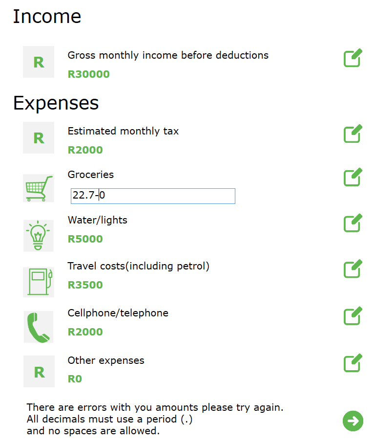

- - - -

Once they correct their error they will be able to move on to the next window.

- - - -

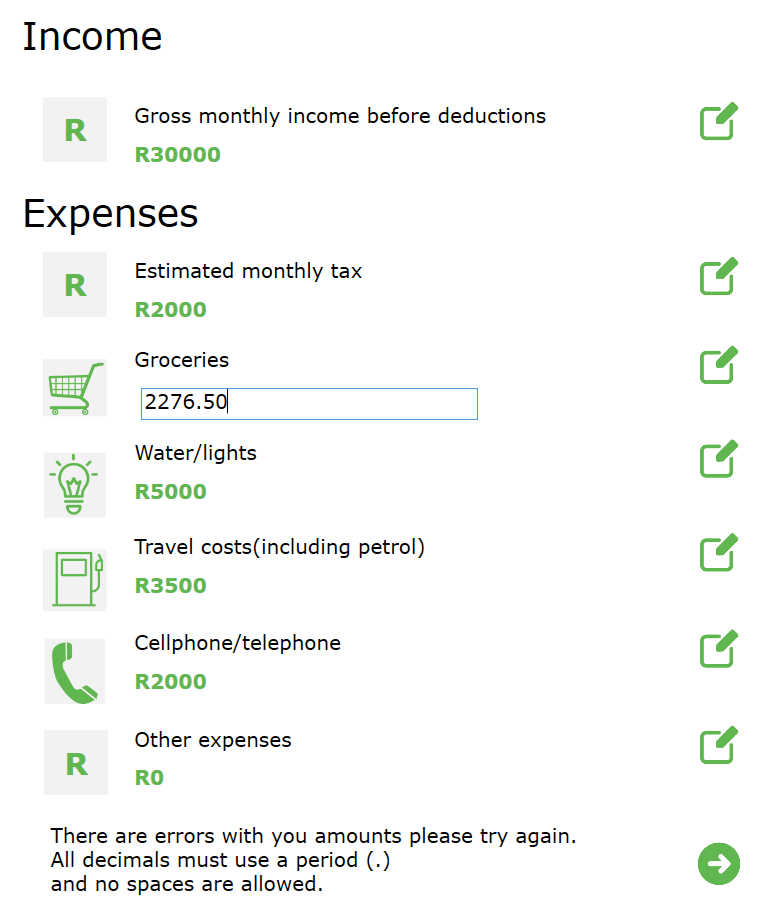

- - - -

When the user clicks the next icon they will be directed to the accomodation page, 
where they can choose to rent or buy.

- - - -

 

 

- - - - 

Now, the user can decide if they are buying a vehicle or not. If they do not select yes or no, they will receive an error and will not be able to continue onto the next window.

- - - -

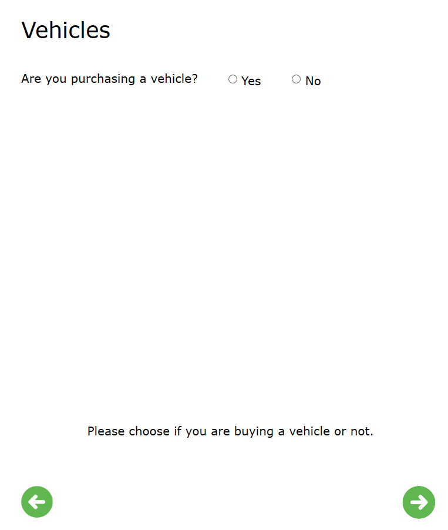

- - - - 

If the user selects to buy a vehicle then they will have to input the make of the vehicle, if they do not do this then an error will be displayed and they will not be able to move further.

- - - -

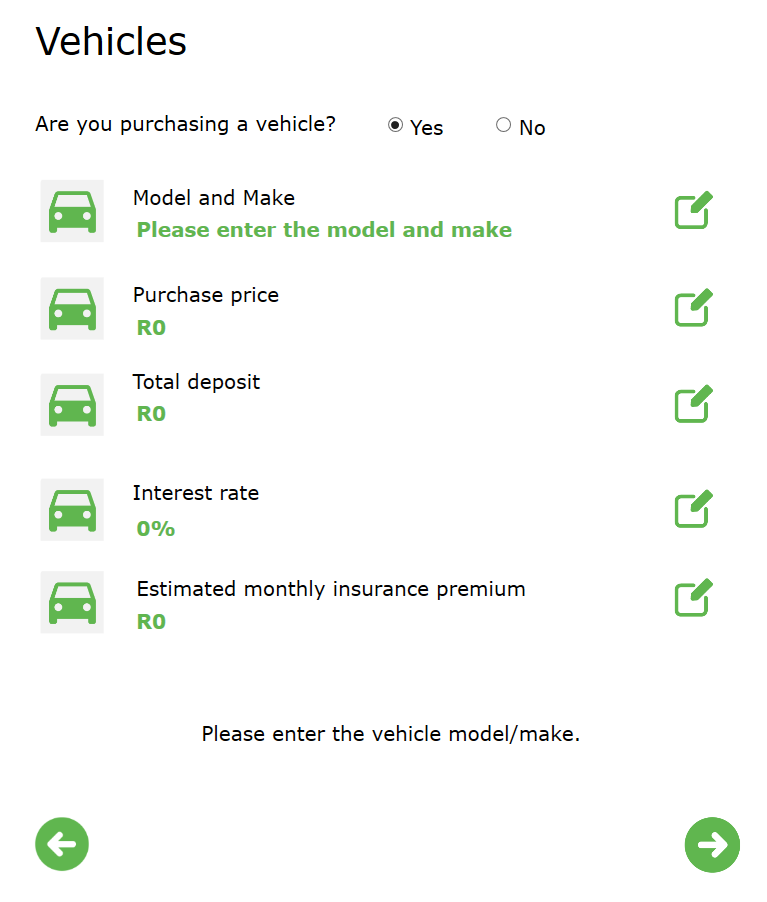

- - - -

Then when they click the next icon the user can select if they have a savings account or not.
If they do not select yes or no an error will be displayed and they will not be able to move further.

- - - -

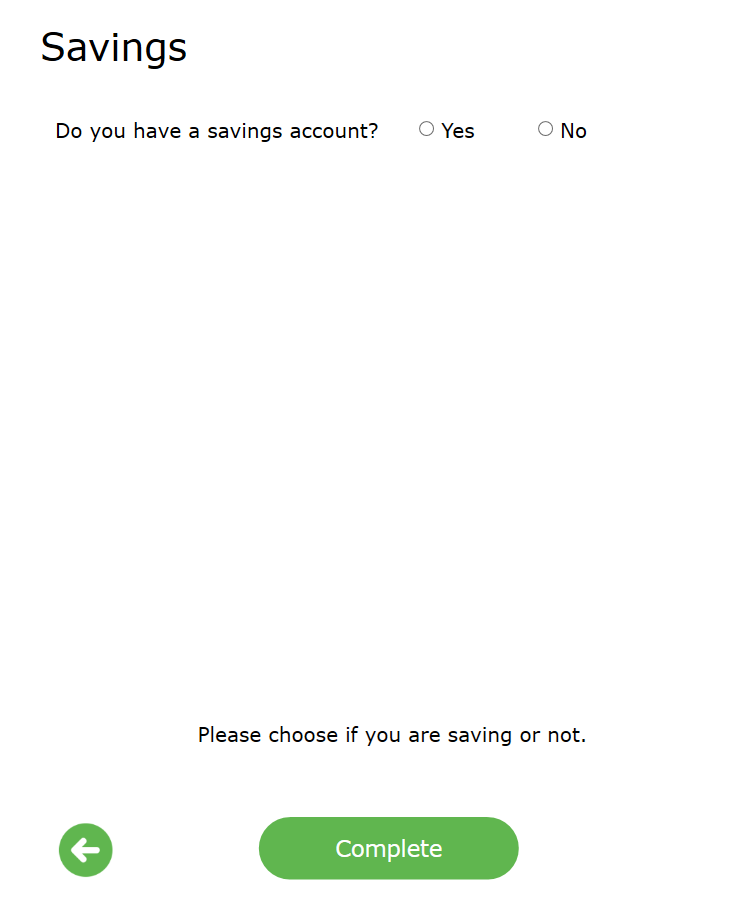

- - - -

If the user does select that they have a savings account they can input all the information.

- - - -

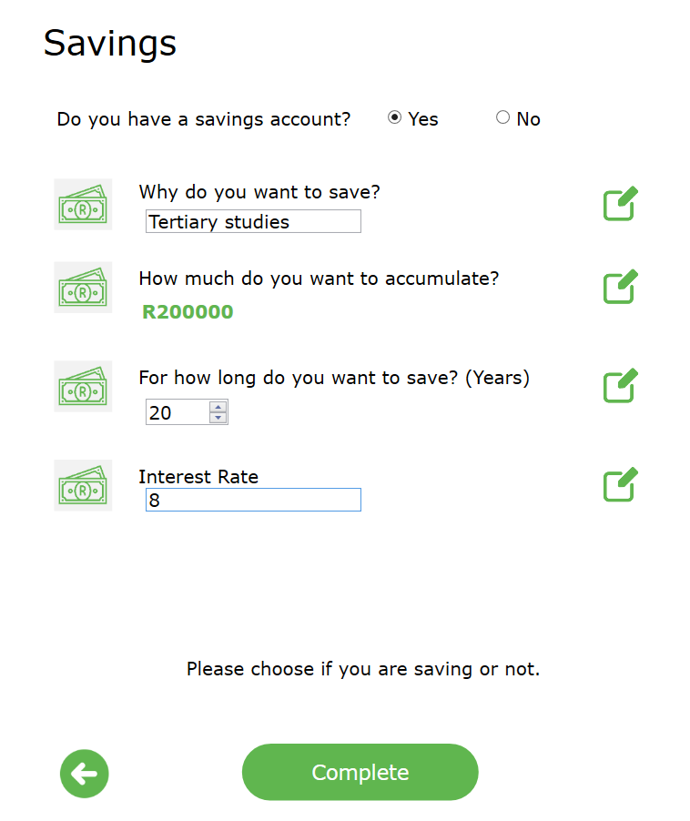

- - - -

 When they click complete they will be directed back to the home page where they will receive a summary of their expenses

- - - - 

(03/06/2022)The home screen has been updated as such to sort the expenses in descending order by default, the user will also be able to sort the expenses in ascending order if they click the high to low button. But the income will always remain at the top of the display. 

- - - -

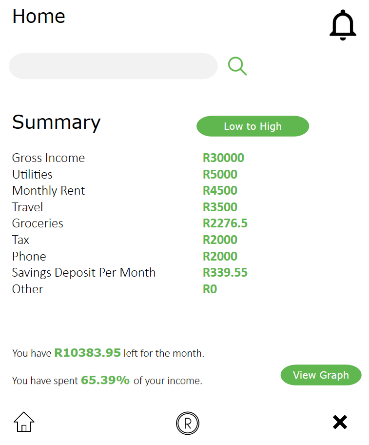

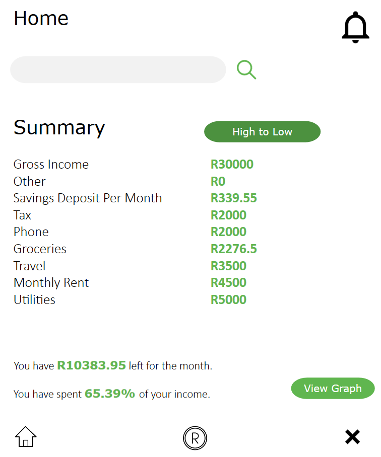

- - - -

If the user clicks the bell icon they will be redirected to the notification page where they can check if they have any notifications.

- - - -

  

- - - -

If they enter something in the search bar they will be redirected to the results page. Once the user enters all their expense information, the search results will show how much of their income they have spent on the expense.

- - - -   

  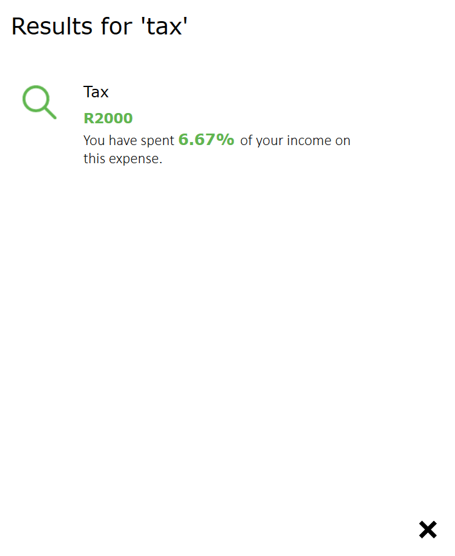

- - - -

If there are no search results it will be displayed that nothing was found.

- - - -

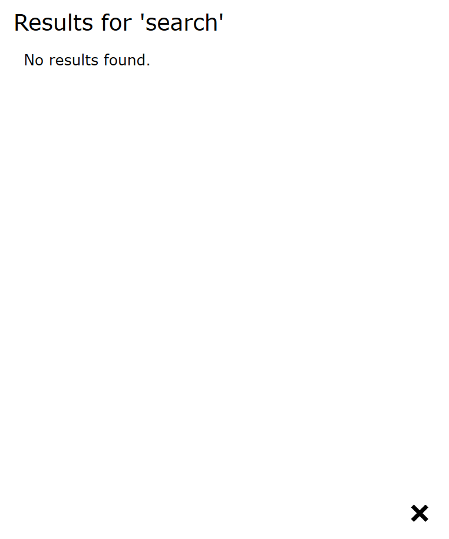

- - - -

On the updated home page, there is a button called View Graph. When the user clicks on this button a graph that shows them their expenses will be displayed.

- - - -

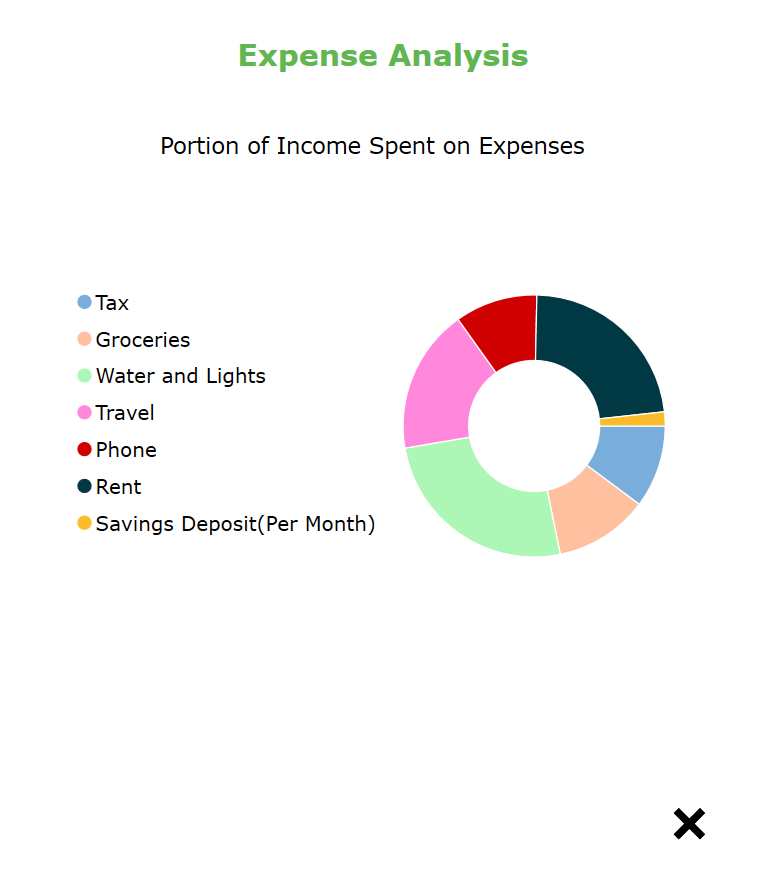

- - - -

If the user hovers their mouse over one of the chart segments, they will see the name of the expense and the value that is being spent on it.

- - - -

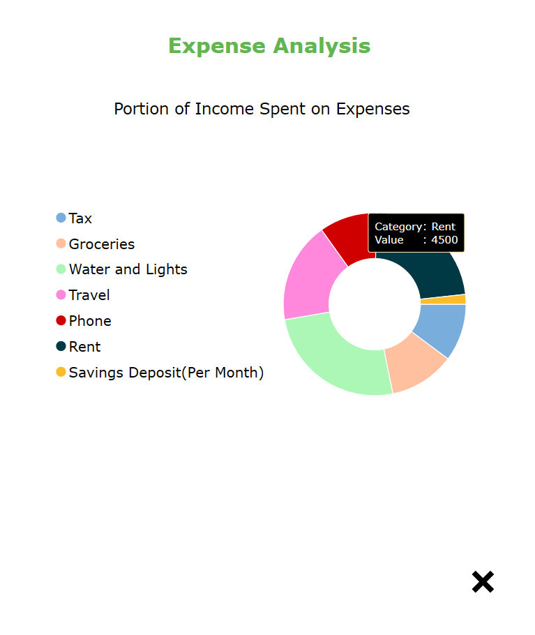

- - - -

If the user clicks on the legend on the left, that part of the chart will disappear.

- - - -

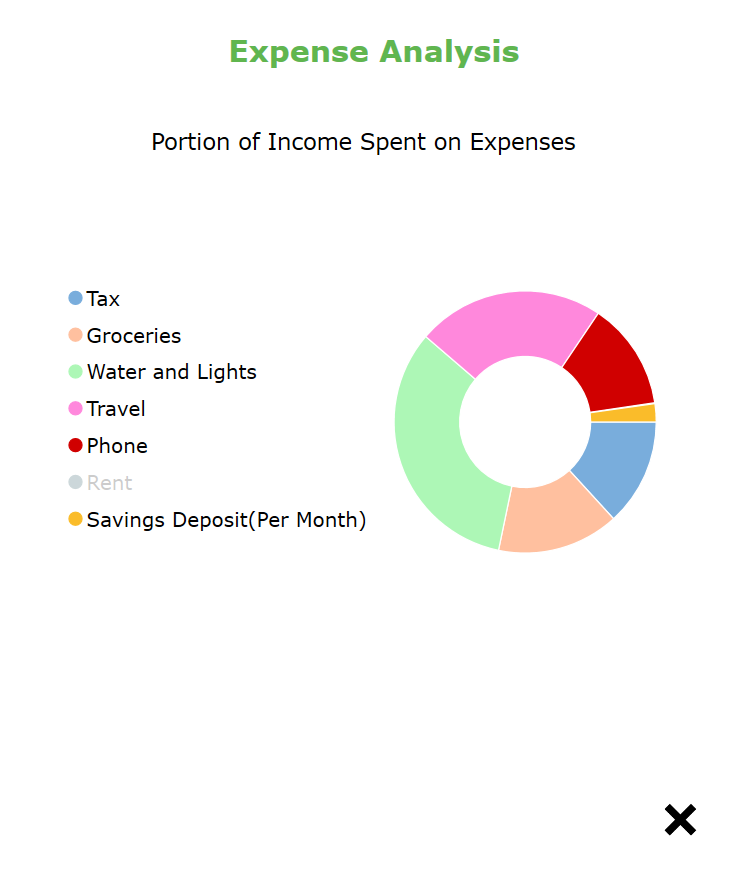

- - - -

### Extra Features
  
  Some extra features in this app include:
  - A search function that allows user to search for a specific expense and see the percentage of income that is being spent on the expense
  - The app calculates the percentage of the income that the user has spent.

  Extra features as of 03/06/2022:   
   - Although the task asks that the user's expenses be sorted in descending order (the program will sort it as such) a button has been provided that will allow the        user to toggle between ascending and descending order.

  Extra features as of 28/06/2022:   
   - The user will be able to view their expenses on a donut chart and be able to toggle which expenses they want to see.
  
### Changes implemented from feedback

As per the feedback I received I have added more in-depth commenting.

[Go To TOP](#TOP)
