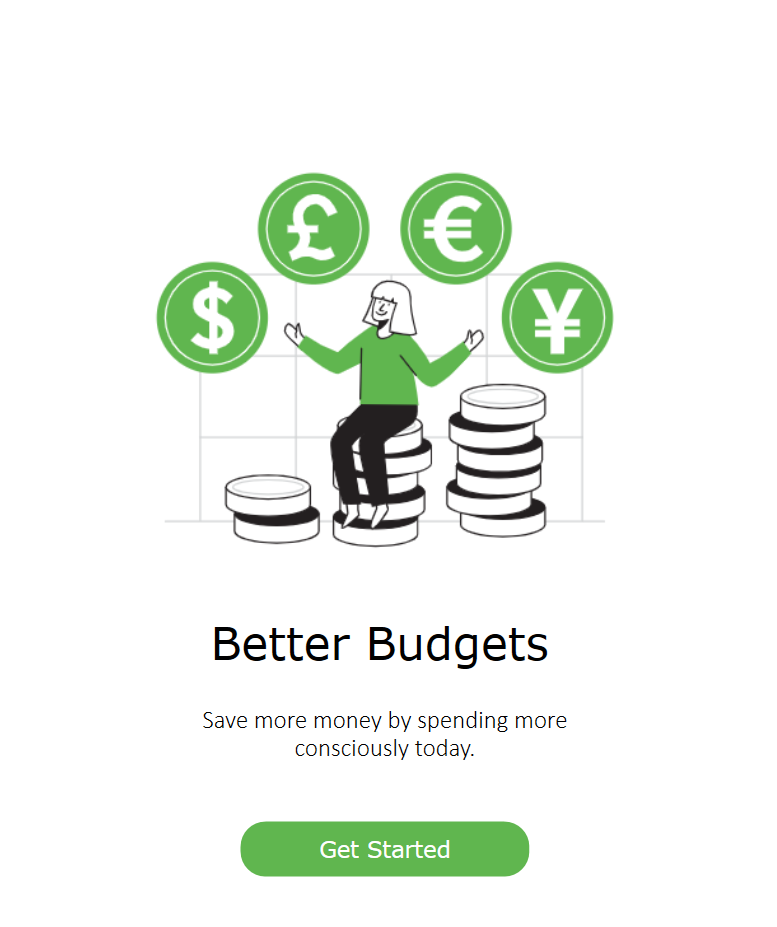
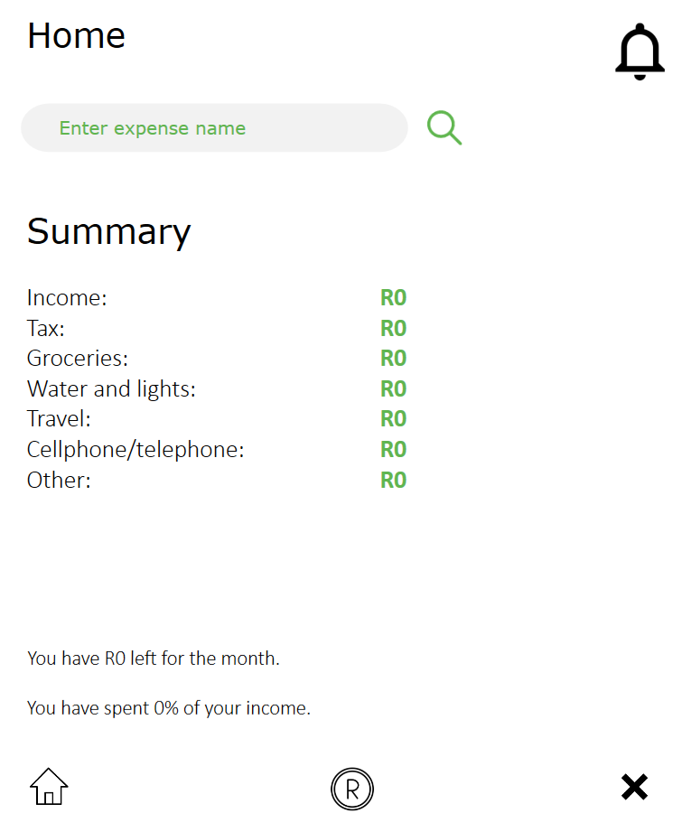
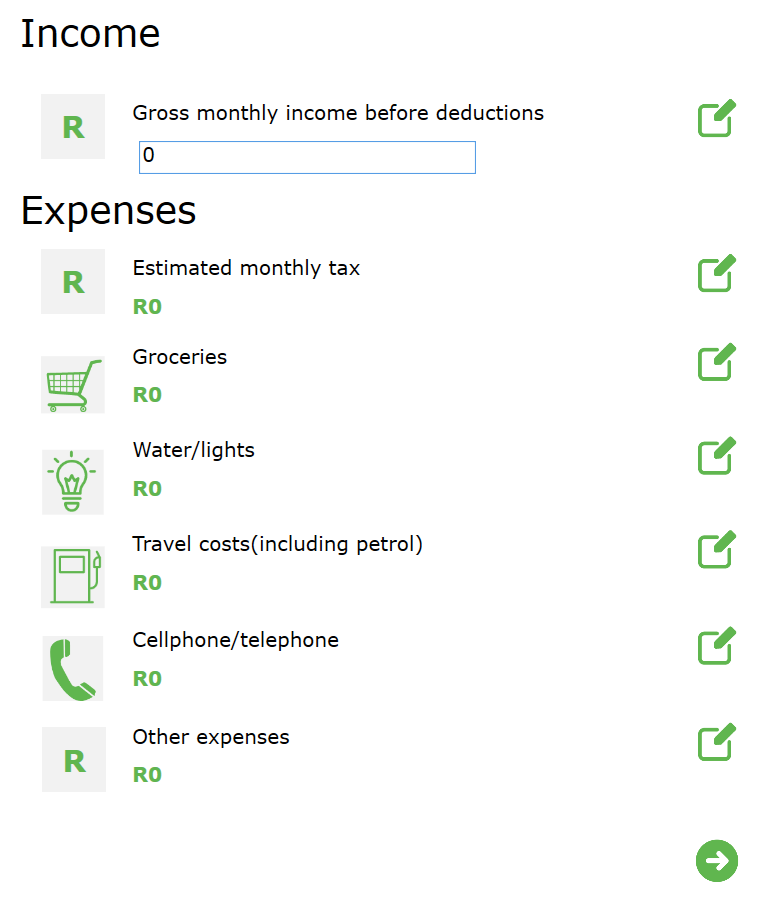
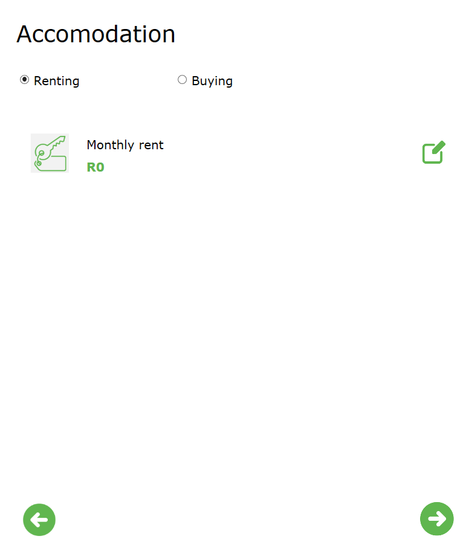
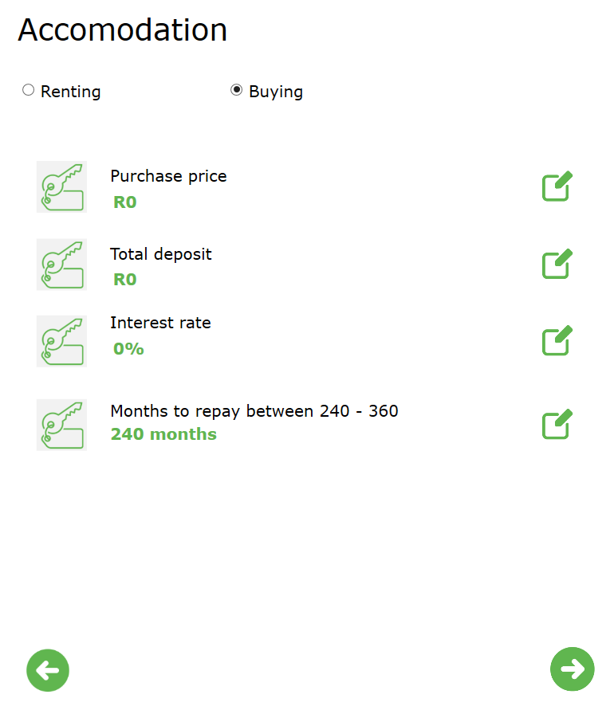
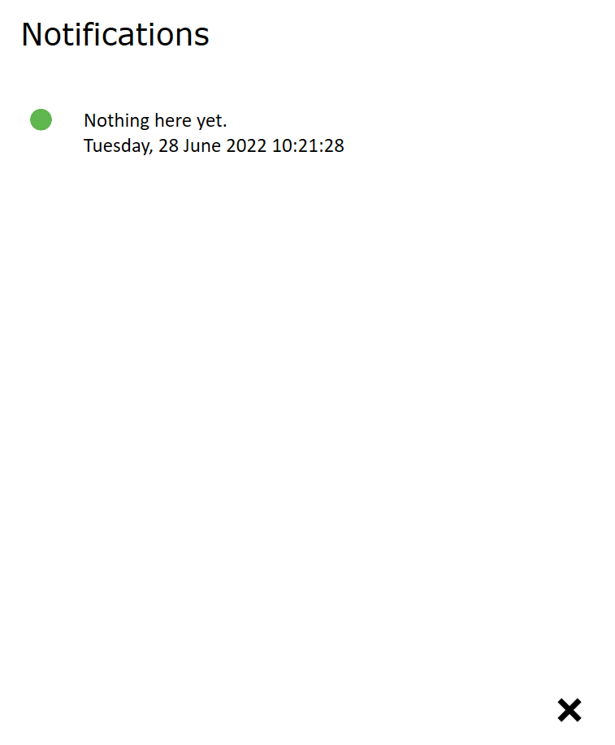

# Better Budgets App

This is a solution to the PROG6221 Task 2.

## Table of contents

- [Overview](#overview)
  - [The scenario](#the-scenario)
      - [Updates](#updates)
  - [Built with](#built-with)
  - [Screenshots](#screenshots)
  - [Extra Features](#extra-features)
  - [Changes implemented from feedback](#changes-implemented-from-feedback)

## Overview

## The scenario

The scenario is to create an application that can be used for personal
budget planning. The user needs to input their income and expected monthly expenses. 
When they have entered all the amounts they will be asked if they will be renting a home or buying one.
If the user decides to rent they will be prompted to enter the rent amount per month.
If they decide to buy then they will be prompted to enter the: 
 - Purchase Price
 - Months to Repay Home Loan
 - Interest Rate
 
When user input is complete, the app will calculate the monthly repayment and tell the user whether their home loan will be approved.
Then the app will calculate how much money the user will have available at the end of the month.

Task 2 asks that the user be able to choose whether they are purchasing a vehicle or not. If they decide to purchase a vehicle they will be asked to enter the cars:
 - Model and make
 - Purchase Price
 - Deposit
 - Estimated Monthly Insurance Premium
 - Interest Rate

All vehicles are to be paid off in 5 years.

Also, Task 2 asks to notify the user when their total expenses exceed 75% of their total income, and use a delegate to do so. 
The arrays used to store the expenses have been changed to a Dictionary, as the task specifies the use of a Generic Collection instead of arrays.
The Dictionary of expenses is then sorted in descending order and displayed to the user.

### Updates

This project was last updated on 28/06/2022. The scenario for the final part of the POE has included more features.

The final part of the POE asks that the user be able to choose whether they have a savings account or not. If they have a savings account they will be asked to enter the cars:
 - Reason they want to save
 - Total amount they want to accumulate
 - How long they want to save for in years
 - Interest Rate
 
 The POE also asks that the project be moved from Windows Forms to WPF(Windows Presentation Foundation).

### Built With
  
  - C#
  - WPF(Windows Presentation Foundation)

### Screenshots

On starting the app the use will see the welcome screen.

- - - -
If they click get started they will be directed to the home screen.
- - - -

- - - -
If the user clicks on the coin icon they will be redirected to the expense page.
- - - -
 
 
- - - -
 If the user clicks on the editing icon they will be able to input values.
 - - - -
 
 
 - - - -
When the user clicks the next icon they will be directed to the accomodation page, 
where they can choose to rent or buy.
- - - -
 
 
 
 
- - - - 
Now, the user can decide if they are buying a vehicle or not.
- - - -
 
 
 
 
- - - - 
 When they click complete they will be directed back to the home page whre they will receive a summary of their expenses
- - - - 
  
  

  

- - - -
  If they click on the bell icon, it will direct them to the notification page and show them if they notifications.
- - - -   
  

- - - -
  The notification has been updated to display the date and time.
- - - -
  

- - - -
  If the user's expenses exceed 75% of their income they receive a notification.
- - - -
  

- - - -
  If they enter something in the search bar they will be redirected to the results page.
- - - -   
  
  
- - - -
  
### Extra Features
  
  Some extra features in this app include:
  - A search function that allows user to search for a specific expense and see the percentage of income that is being spent on the expense
  - The app calculates the percentage of the income that the user has spent.

  Extra features as of 03/06/2022:   
   - Although the task asks that the user's expenses be sorted in descending order (the program will sort it as such) a button has been provided that will allow the        user to toggle between ascending and descending order.

  Extra features as of 28/06/2022:   
   - The user will be able to view their expenses on a donut chart and be able to toggle which expenses thez want to see.
  
### Changes implemented from feedback

As per the feedback I received I have added more in-depth commenting.

[Go To TOP](#TOP)
